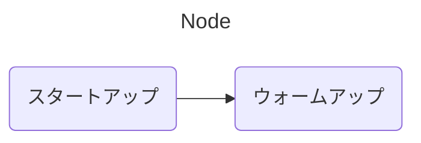
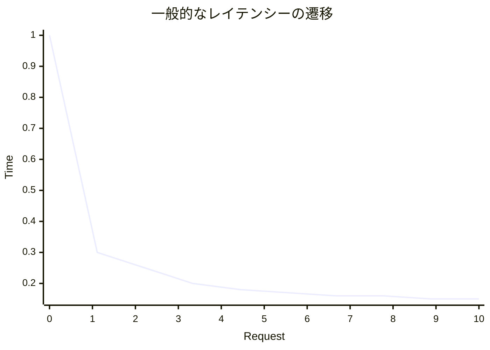

## Java x Spring Boot製アプリケーションのコールドスタートに立ち向かう！

## 〜暖機運転のアプローチいろいろやってみた〜

<br>

2024/10/27 Presentation for JJUG CCC 2024 Fall

菊地 和真@kazu_kichi_67

<div class="abs-br m-6 flex gap-2">
  <a href="https://x.com/kazu_kichi_67" target="_blank" alt="X" title="Open in X"
    class="text-xl slidev-icon-btn opacity-50 !border-none !hover:text-white">
    <carbon-logo-x />
  </a>
  <a href="https://github.com/kazu-kichi-67" target="_blank" alt="GitHub" title="Open in GitHub"
    class="text-xl slidev-icon-btn opacity-50 !border-none !hover:text-white">
    <carbon-logo-github />
  </a>
</div>

---
layout: section
hideInToc: true
---

TODO: 資料のQR

---
src: ./pages/who-am-i.md
hide: false
---

---
hideInToc: true
---

# Agenda

***

<Toc maxDepth="2"/>

---
layout: section
---

# なぜ暖機運転が必要なのか？

---
level: 2
---

# コールドスタートとは何か？

***

<br>

<v-clicks>

- スタートアップ（起動するまでの時間）+ ウォームアップ（ピークパフォーマンスに達するまでの時間）
- クラスのロード + JITによる最適化
- コンテナやサーバレスの普及によって、恩恵よりもデメリットが目立つようになった

</v-clicks>

<br>

<div class="grid grid-cols-2 gap-4">

<div v-click>



</div>

<div v-click >



</div>

</div>

---
layout: section
---

# 暖機運転のアプローチ

---
level: 2
---

# 繰り返し呼べるように環境を整える

***

<br>

```java {*|3|2-4|1,5|*}
class HelloWorld {
	public static void main(String[] args) {
		System.out.println("Hello, world.");
	}
}
```

<br>

### メリット

- ほげ

<br>

### デメリット

- ほげ

---
level: 2
---

# 特殊ルートの実装

***

<br>

```java {*|3|2-4|1,5|*}
class HelloWorld {
	public static void main(String[] args) {
		System.out.println("Hello, world.");
	}
}
```

<br>

### メリット

- ほげ

<br>

### デメリット

- ほげ

---
level: 2
---

# Dynamic Dependency Injection

***

<br>

```java {*|3|2-4|1,5|*}
class HelloWorld {
	public static void main(String[] args) {
		System.out.println("Hello, world.");
	}
}
```

<br>

### メリット

- ほげ

<br>

### デメリット

- ほげ

---
level: 2
---

# Dynamic Data Source

***

<br>

```java {*|3|2-4|1,5|*}
class HelloWorld {
	public static void main(String[] args) {
		System.out.println("Hello, world.");
	}
}
```

<br>

### メリット

- ほげ

<br>

### デメリット

- ほげ

---
layout: section
---

# 暖機運転以外のアプローチ


---
level: 2
---

# Class Data Sharing（CDS）

***

<br>

- ほげ

---
level: 2
---

# Native化（GraalVM）

***

<br>

- AOTコンパイル

---
level: 2
---

# Coordinated Restore at Checkpoint(CRaC)

***

<br>

- ほげ

---
level: 2
---

# Project Leyden

***

<br>

- ほげ

---

# まとめ

***

<br>

- ほげ

---
hideInToc: true
---

参考

|        |                              |
| ------ | ---------------------------- |
| AAAAAA | aaa                          |
| BBB    | bbbbbbbb                     |
| C      | <kbd>ccccccccccccccccc</kbd> |

---
layout: center
class: text-center
hideInToc: true
---

# End

良いJava Lifeを！


