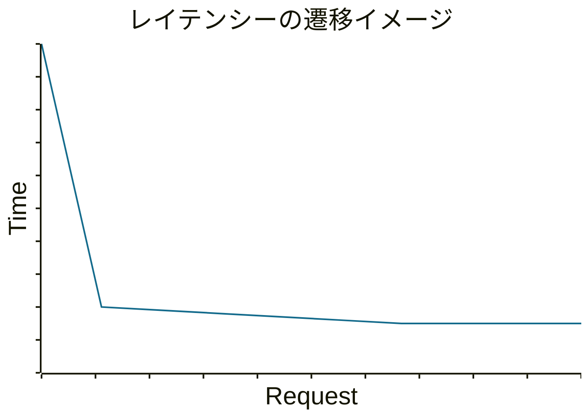

## Java x Spring Boot製アプリケーションのコールドスタートに立ち向かう！

## 〜暖機運転のアプローチいろいろやってみた〜

<br>

2024/10/27 Presentation for JJUG CCC 2024 Fall

菊地 和真@kazu_kichi_67

<div class="abs-br m-6 flex gap-2">
  <a href="https://x.com/kazu_kichi_67" target="_blank" alt="X" title="Open in X"
    class="text-xl slidev-icon-btn opacity-50 !border-none !hover:text-white">
    <carbon-logo-x />
  </a>
  <a href="https://github.com/kazu-kichi-67" target="_blank" alt="GitHub" title="Open in GitHub"
    class="text-xl slidev-icon-btn opacity-50 !border-none !hover:text-white">
    <carbon-logo-github />
  </a>
</div>

---
layout: center
class: text-center
hideInToc: true
---


<!-- https://twitter.com/search?q=%23jjug_ccc%20%23jjug_ccc_j -->

<br>

<kbd id="highlight">[#jjug_ccc](https://twitter.com/search?q=%23jjug_ccc)</kbd>
<br>
<br>
<br>
<kbd id="highlight">[#jjug_ccc_j](https://twitter.com/search?q=%23jjug_ccc_j)</kbd>

---
src: ./pages/who-am-i.md
hide: false
---

---
layout: section
---

# 本題に入る前に準備

---
level: 2
hideInToc: true
---

# 背景

***

<br>

- ECサイトにおけるカート決済システムのリプレイス案件
- Java 21
- Spring Boot 3系
- Amazon EKS（Elastic Kubernetes Service）
- Domain-Driven Design
- Onion Architecture
- バックエンドのAPIアプリケーション


<!-- 開発を進めて終盤戦、負荷試験を行ったところ、気づいちゃいました。 -->

---
layout: section
hideInToc: true
---

<div id="highlight">
なんか、最初のリクエストだけ<br>
異常に遅くない・・？？
</div>

<!-- 調べてみるとコールドスタートと言うらしい、、 -->

---
layout: section
hideInToc: true
---

<div id="highlight">
地味に困ってる人多い気がするけど、
情報少なくない・・？？
</div>

---
layout: section
hideInToc: true
---

<div id="highlight">
「情報は発信する人に集まる」<br>
よし、登壇しよう！！
</div>

---
level: 2
hideInToc: true
---

# アジェンダ

***

<br>

### 話すこと

- コールドスタートと暖機運転について
- 自力で頑張る暖機運転のアプローチ
- ランタイムが提供するアプローチ

<br>

### 話さないこと

- 各アプローチの詳細な説明
- パフォーマンス問題に対する銀の弾丸
- 背景によって最適解は異なるため、各々で計測・検証をお願いします🙏

<!-- 全体像を俯瞰することで、最初の調査・検討ステップの短縮になれば幸いです -->

---
level: 2
hideInToc: true
---

# コールドスタートとは何か？

***

<br>

- スタートアップ：アプリケーションが起動するまでの時間
- <span v-mark.red>ウォームアップ：ピークパフォーマンスに達するまでの時間</span>
- スタートアップ + ウォームアップ => コールドスタート

<!-- エンジンが温まりきる前までの時間をコールドスタートと呼ぶ -->

---
level: 2
hideInToc: true
---

# ウォームアップの段階

***

<br>

- <span v-mark.red>初回リクエスト特有の遅延： 1回のリクエストでそこそこ効く</span>
- JITコンパイラ（Just In Time Compile）による最適化： 一般的にC1で数千、C2で3万回程度のリクエストが必要

<br>

<div class="grid grid-cols-2 gap-4">

<div>



</div>

<div>


出典元: https://shipilev.net/talks/j1-Oct2011-21682-benchmarking.pdf

</div>

</div>

<style>
p {
    font-size: 10pt
}
</style>

<!-- 極限まで性能を求められるようなユースケースでない場合は、数回程度のリクエストでも満足できることが多いです -->

---
level: 2
hideInToc: true
---

# ウォームアップの重要性

***

<br>

- アプリケーションの生存時間は短くなっている
  - コンテナやサーバレスの普及
    - Podの再起動、オートスケールアップ
  - アジャイル開発による、高速なリリースサイクル
- <span v-mark.red>恩恵よりもデメリットが目立つようになってきた</span>

<!-- 特に最近重要性が増してるって話 -->

---
level: 2
hideInToc: true
---

# どうやって暖機するのか？

***

<br>

- <span v-mark.red>ユーザーからのリクエストを受け付ける前に、実際にAPIを呼び出してあげる</span>
  - 例えば、、
  - Spring Boot Actuatorでアプリケーションの状態を可視化
  - kubernetesのStartup Probeでリクエストを投げる
- 参照系は比較的容易、では<span v-mark.circle.orange>更新系</span>は？

<br>

### 参考

[Liveness and Readiness Probes with Spring Boot](https://spring.io/blog/2020/03/25/liveness-and-readiness-probes-with-spring-boot)

[Liveness, Readiness, and Startup Probes](https://kubernetes.io/docs/concepts/configuration/liveness-readiness-startup-probes/)

<!-- 参照系：検索や商品詳細<br>
冪等性 -->

---
layout: section
---

# 自力で頑張るアプローチ

---
level: 2
---

# 繰り返し呼べるように環境を整える

***

<br>

### 注文APIについて考えてみる

<v-clicks>

- 暖機用のユーザ、商品を準備する
- 自動で注文をキャンセルする仕組みが必要
- キャンセルを繰り返すユーザに対して罰則があればその対象外とする
- 検索に載せないなど、一般ユーザには買えない仕組みが欲しい
- 計測や分析側への影響も考慮する必要あり
- などなど・・・

</v-clicks>

<!-- ノイズ！ -->

---
layout: section
hideInToc: true
---

<div id="highlight">

❌ めっちゃつらい🤮

</div>

---
level: 2
---

# 特殊ルートの実装

***

<br>

### コードサンプル

```java {*|1-2|3|7-9|4-6|*}
@Repository
public class OrderRepositoryImpl implements OrderRepository {
	public OrderId create(Order order) {
    if (order.userId().isWarmup()) {
      // 暖機運転用の特殊ルート
      return OrderId.ofWarmup();
    } else {
      // 注文作成
    }
  } 
}
```

---
level: 2
hideInToc: true
---

# 特殊ルートの実装

***

<br>

### Pros/Cons

<v-clicks>

- ⭕️ 最も手軽ですぐに始められる
- 🔺 特殊ルートから先は暖機されないため、その分効果が小さい
- ❌ 実装・メンテナンスコスト大
  - ビジネスロジック（ドメインモデル）に余計な関心ごとが入り込む

</v-clicks>

<br>

<v-click>

### 一言メモ

- 本当にクリティカルな時、小規模かつ暫定的に導入するにとどめましょう

</v-click>

---
level: 2
---

# Dynamic Dependency Injection

***

<br>

### コードサンプル

```java {*|1,3|2,4-5|7-12|9|11|*}
@Configuration
@RequiredArgsConstructor
public class WarmupConfiguration {
  private final BeanFactory beanFactory;
  private final WarmupService warmupService;

  @Bean
  @Primary
  @Scope(value = "prototype", proxyMode = ScopedProxyMode.INTERFACES)
	public OrderRepository orderRepository() {
		return beanFactory.getBean(warmupService.getMode() + "OrderRepository", OrderRepository.class);
	}
}
```

[Interface BeanFactory](https://docs.spring.io/spring-framework/docs/current/javadoc-api/org/springframework/beans/factory/BeanFactory.html)

[Bean Scopes](https://docs.spring.io/spring-framework/reference/core/beans/factory-scopes.html)

---
level: 2
hideInToc: true
---

# Dynamic Dependency Injection

***

<br>

### Pros/Cons

<v-clicks>

- ⭕️ 暖機の関心ごとをクラス毎に切り離せる
- 🔺 切り替えたクラスから先のコードが異なるため、その分効果が小さい
- 🔺 実装・メンテナンスコスト中
- ❌ 該当クラスが呼び出される度にDIされる

</v-clicks>

<br>

<v-click>

### 一言メモ

- こちらもずっと保守していくのは厳しい・・<br>コードは消しやすいので、こちらも暫定的な導入に留めましょう

</v-click>

---
level: 2
---

# Dynamic Data Source

***

<br>

### コードサンプル①

```java {*|3|6-7|8|*}
@Component
@RequiredArgsConstructor
public class DynamicRoutingDataSource extends AbstractRoutingDataSource {
  private final WarmupService warmupService;

  @Override
  protected Object determineCurrentLookupKey() {
		return warmupService.getMode();
	}
}
```

[Class AbstractRoutingDataSource](https://docs.spring.io/spring-framework/docs/current/javadoc-api/org/springframework/jdbc/datasource/lookup/AbstractRoutingDataSource.html)

<!-- 自前でシャーディングする時とかに使ってる模様 -->

---
level: 2
hideInToc: true
---

# Dynamic Data Source

***

<br>

### コードサンプル②

```java {*|3|11-13|15-16|*}
@Configuration
@RequiredArgsConstructor
public class DynamicDataSourceConfiguration {
  private final DynamicRoutingDataSource dynamicRoutingDataSource;

  ・・・

  @Bean
  @Primary
	public DataSource dataSource() {
    Map<Object, DataSource> dataSources = new LinkedHashMap<>();
    dataSources.put(WarmupMode.PROD, prodDataSource());
    dataSources.put(WarmupMode.WARMUP, warmupDataSource());

    dynamicRoutingDataSource.setTargetDataSources(dataSources);
    dynamicRoutingDataSource.setDefaultTargetDataSource(prodDataSource());

		return dynamicRoutingDataSource;
	}
}
```

---
level: 2
hideInToc: true
---

# Dynamic Data Source

***

<br>

### Pros/Cons

<v-clicks>

- ⭕️ データを自由に準備できるため、暖機の自由度が高い
- ⭕️ 暖機効果が大きい
- ⭕️ 実装・メンテナンスコスト小
- ❌ インフラの整備が必要

</v-clicks>

<br>

<v-click>

### 一言メモ

- ややトリッキーではあるが、インフラ構築さえできれば色々なユースケースに対応できそう

</v-click>

---
level: 2
hideInToc: true
---

# 前半のまとめ

***

<br>

|                          | 特殊ルート | Dynamic Dependency Injection |   Dynamic Data Source    |
| ------------------------ | ---------- | ---------------------------- | ------------------------ |
| 暖機効果                 | 🔺 中       | 🔺 中                         | ⭕️ 大                    |
| 実装・メンテナンスコスト | ❌ 大       | 🔺 中                         | ⭕️ 小                    |
| その他                   | ⭕️ 手軽    | ⭕️ クラス毎に切り替え可能    | ⭕️ 暖機の自由度が高い    |
|                          |            | ❌ 都度DIあり                 | ❌ インフラ整備の必要あり |

<br>

<v-click>

### 結論

- どのアプローチもデメリット（痛み）を伴う

</v-click>

---
layout: section
---

# ランタイムが提供するアプローチ

<!-- Javaとしても長年コールドスタートに対して課題感を持っていました -->

---
level: 2
---

# Class Data Sharing（CDS）

***

<br>

- [JEP 310: Application Class-Data Sharing](https://openjdk.org/jeps/310)
  - Java 10で導入された、手動でアーカイブを作成する仕組み
  - class listの作成 → アーカイブ作成(dump) → アーカイブを使用して起動
- [JEP 341: Default CDS Archives](https://openjdk.org/jeps/341)
  - Java 12で導入された、ユーザの操作なしにデフォルトでCDSが有効になる機能
- [JEP 350: Dynamic CDS Archives](https://openjdk.org/jeps/350)
  - Java 13で導入された、動的にアーカイブを作成する仕組み
- 🔺 いずれも起動時間の改善を目標としたもの
- 🔺 CI/CDのリリースサイクルを見直す必要がある

---
level: 2
---

# Native化（GraalVM）

***

<br>

- AOTコンパイル（Ahead of Time Compile）: 事前にネイティブコードにコンパイルする
- ⭕️ 起動時間
- ⭕️ パフォーマンス
- 🔺 利用しているライブラリがちゃんと動くかは要検証
  - [Libraries and Frameworks Tested with Native Image](https://www.graalvm.org/native-image/libraries-and-frameworks/)
- 🔺 コンパイルに時間がかかり、開発体験が変わる
- ❌ アプリケーションの規模などにもよるが、移行のハードルは高め
  - リフレクションのように実行時に決まる要素については、コンパイル時に明示的に指定する必要がある 等

---
level: 2
---

# CRaC(Coordinated Restore at Checkpoint)

***

<br>

- アプリケーションのチェックポイントを作成し、復元する形で起動できる
- AWS LambdaのSnapStartで活用されている
- ⭕️ 起動時間
- ⭕️ パフォーマンス(継続してJITコンパイルの最適化が行われる)
- 🔺 チェックポイント作成時にDB接続やファイルハンドルを閉じる必要がある
- 🔺 シークレットな情報がスナップショットに含まれるリスクがある
- ❌ Linux KernelのCheckpoint/Restore in Userspace（CRIU）を利用するため、実行環境に依存する
- 現時点だと、[OpenJDKのEAビルド](https://wiki.openjdk.org/display/crac)、[Azul JDKの一部](https://wiki.openjdk.org/display/crac)、[Liberica JDK](https://bell-sw.com/libericajdk-with-crac/)で利用可能
- adoptium/temurin-buildでは未対応 - [Including CRac for container image](https://github.com/adoptium/temurin-build/issues/3604)

---
level: 2
---

# Project Leyden

***

<br>

- [Project Leyden](https://openjdk.org/projects/leyden/)
- 起動時間、ピークパフォーマンスまでの時間、メモリの改善を目指している
- CDS + AOTのようなアプローチ
- [Leyden Early Access Release](https://github.com/openjdk/leyden/blob/leyden-ea1-release-notes/README.md)
- [JEP 483: Ahead-of-Time Class Loading & Linking](https://openjdk.org/jeps/483)
- [JEP draft: Unified Ahead-of-Time Cache](https://openjdk.org/jeps/8320264)
- [JEP draft: Ahead-of-Time Method Profiling](https://openjdk.org/jeps/8325147)
- [JEP draft: Ahead-of-Time Code Compilation](https://openjdk.org/jeps/8335368)

<br>

<v-click>

### → 銀の弾丸となりうるか？　要注目!!

</v-click>

---

# まとめ

***

<br>

- 暖機運転を行うのが望ましい
- <span v-mark.red>コストやリスクのトレードオフを考慮し、本当に必要なところだけ導入する</span>
- Javaの今後のバージョンアップにも注目!!


<!-- 現時点ではクリティカルなタイムアウト等は発生していないため、<br>
いざという時の手札を揃えておきつつ、<br>
CRaCやProject Leydenの動向をチェックしている状況です。 -->

---
layout: center
class: text-center
hideInToc: true
---

# End

Thank you for listening!

良いJava Lifeを！


